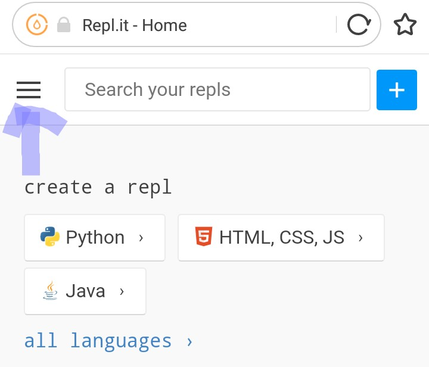
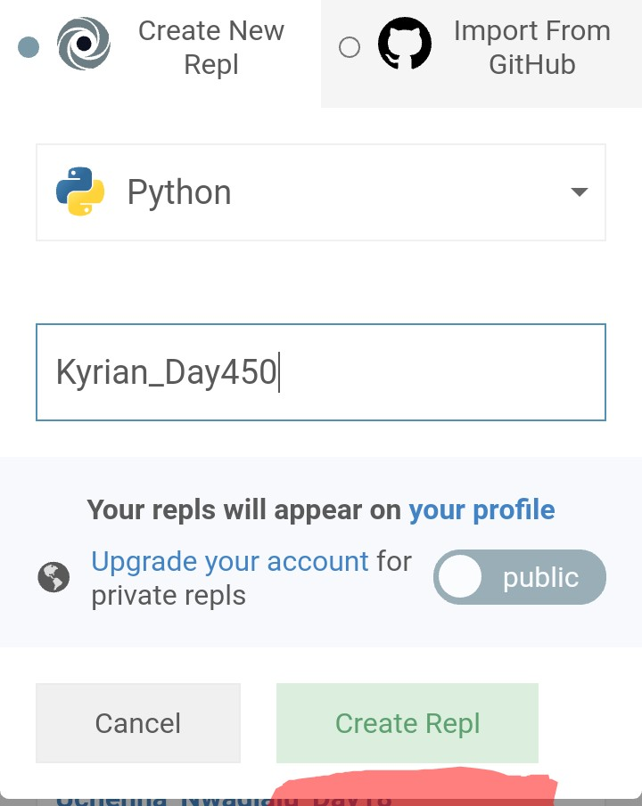
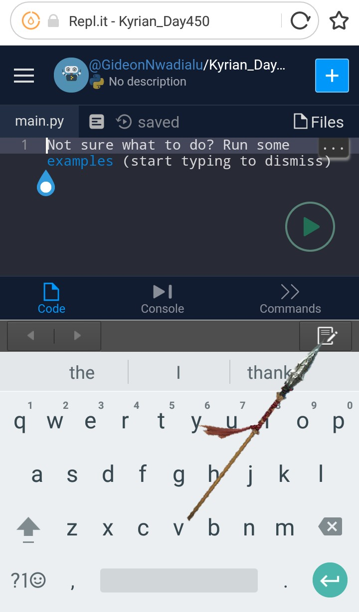
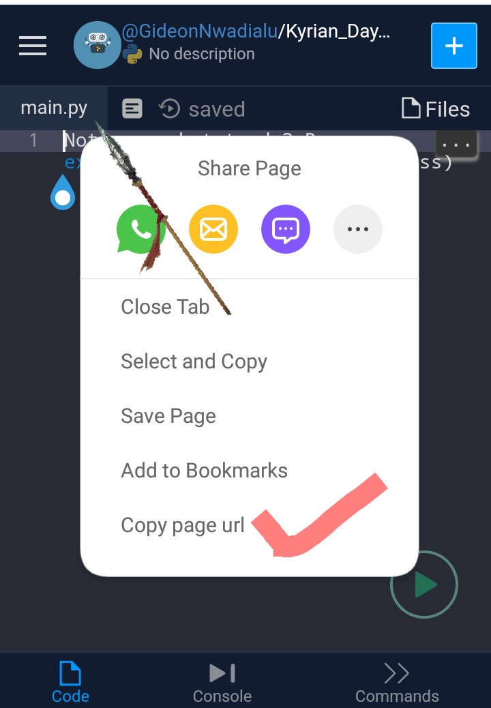

# Python Submission Guide
  1. Go to www.repl.it
  2. Sign up if you don't have an account
     

  3. Create a new file
     
     *Choose Python
     *Name your file(preferably,use your name and task day)
     
  4. Type or copy your code and run it to ensure it works
     
  5. Copy the pages URL and paste it on submission URL space.
     
     
  6. Ensure you select the right day,level and track.
  7. Drop comments if you want to.
  8. Don't forget to tweet
